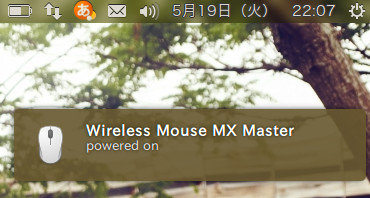

#Ubuntuのアプリケーションと設定
##日本語のディレクトリを英語に

```bash
env LANGUAGE=C LC_MESSAGES=C xdg-user-dirs-gtk-update
```

  
##ubuntu_setup.shの実行
* 環境 Ubuntu 14.04 64bit
* 動作確認日 2015.3.16
* 適宜、下の一覧を見て必要ないなと思うパッケージはスクリプトから消すこと

スクリプトは以下のコマンドで実行

```bash
git clone https://github.com/Ry0/my_ubuntu_setup.git
cd my_ubuntu_setup/ubuntu_application
sudo sh ubuntu_application.sh
```

※最後の行で以下のように引数`all`をつけるといるのかこれ？っていうようなアプリも入ります  
下のアプリ一覧の全て入れたい場合のみ3行目を

```bash
sudo sh ubuntu_application.sh all
```

にする

##ubuntu_setup.shの内容
このスクリプトで入るアプリケーション  
○がついているアプリケーションが引数なしで実行しても入る必須ソフト，無印なものは引数`all`をつけて入るもの

||パッケージ名|説明|参考サイト|
|-:-|:--|:--|:--|
|○|nemo|プラグインとしてnemo-dropbox nemo-emblems nemo-image-converterが入る|[http://www.webupd8.org/2014/08/nemo-emblems-folder-color-image.html](http://www.webupd8.org/2014/08/nemo-emblems-folder-color-image.html)|
|○|sublime-text|おすすめエディタ|[http://ry0.github.io/blog/2015/02/15/install-sublimetext2/](http://ry0.github.io/blog/2015/02/15/install-sublimetext2/)|
|○|emacs24|定番エディタ|[]()|
|○|meld|差分ビューア|[]()|
|○|terminator|標準ターミナルの拡張版|[]()|
|○|ubuntu-tweak|デフォルトで起動するソフトを拡張子ごとに変更するのに使用|[]()|
|○|compizconfig-settings-manager|ウィンドウの最小化、Unity透明化等|[http://ubuntuapps.blog67.fc2.com/blog-entry-634.html](http://ubuntuapps.blog67.fc2.com/blog-entry-634.html)[http://ubuntuapps.blog67.fc2.com/blog-entry-689.html](http://ubuntuapps.blog67.fc2.com/blog-entry-689.html)|
|○|unity-tweak-tool|Ubuntuの細かい設定をする|[]()|
|○|gnome-tweak-tool|もうほとんど使わないかも|[]()|
||fontforge|フォントを結合するとき用|[http://galaxy-shw-m110s.blogspot.jp/2011/12/galaxyflipfontno.html](http://galaxy-shw-m110s.blogspot.jp/2011/12/galaxyflipfontno.html)|
|○|nkf|文字コード変換|http://itpro.nikkeibp.co.jp/article/COLUMN/20060227/230849/|
|○|gimp|画像編集|[]()|
|○|inkscape|作図用|[]()|
|○|gnuplot|グラフプロット|[]()|
||easystroke|マウスのボタン設定|[http://mimikakimemo.hatenablog.jp/entry/2012/11/24/022457](http://mimikakimemo.hatenablog.jp/entry/2012/11/24/022457)|
||skype|チャットツール|[]()|
||google-chrome-stable|firefoxのサブ|[]()|
|○|kazam|画面キャプチャーソフト|[]()|
||audacious|高音質？音楽プレーヤ|[http://blog.goo.ne.jp/hiros-pc/e/c7a272e8c4eb2396225fa1a9dd6e1639](http://blog.goo.ne.jp/hiros-pc/e/c7a272e8c4eb2396225fa1a9dd6e1639)|
|○|vlc|定番動画プレイヤー|[]()|
||smplayer|vlcでは再生がうまくできなかったときの控え選手|[]()|
||pcsx2|PS2エミュレータ|[]()|
||GRhino|オセロゲーム。リフレッシュにでも|[]()|
||indicator-multiload|システム情報をパネルに表示|[http://ubuntuapps.blog67.fc2.com/blog-entry-281.html](http://ubuntuapps.blog67.fc2.com/blog-entry-281.html)|
||indicator-sensors|タスクバーにCPU、グラボの温度、ファンの負荷を表示|[http://techlack.hatenablog.com/entry/2015/02/03/075501](http://techlack.hatenablog.com/entry/2015/02/03/075501)|
||indicator-sound-switcher|タスクバーから音声出力を切り替え|[http://moebuntu.blog48.fc2.com/blog-entry-748.html](http://moebuntu.blog48.fc2.com/blog-entry-748.html)
|○|exfat-fuse exfat-utils|ストレージのexfatフォーマットに対応|[]()|
|○|smartgit|GUIのgit管理ソフト|[http://thjap.org/linux/ubuntu/6309.html](http://thjap.org/linux/ubuntu/6309.html)|
|○|ScudCloud|slackのクライアントソフト|[http://www.makeuseof.com/tag/linux-loving-slack-users-heres-an-app-for-you/](http://www.makeuseof.com/tag/linux-loving-slack-users-heres-an-app-for-you/)|
||Solaar|Logicoolの無線マウスのバッテリー確認等|[http://blog.keshi.org/hogememo/2013/11/04/solaar-using-logitech-unifying-in-linux](http://blog.keshi.org/hogememo/2013/11/04/solaar-using-logitech-unifying-in-linux)|
|○|unrar rar|書庫マネージャをrar対応にさせる|[]()|
|○|gparted|パーティション管理ソフト|[]()|
||wine|Windows用Evernoteを動かすために使用|[]()|
|○|oracle-java8-installer|javaがないと動かないソフトもあるので一応|[]()|

wineとjavaに関しては途中で同意が必要  
あと最後以下のようなメッセージが出たら、`Enter`を押す。

```bash
  選択肢    パス                           優先度  状態
------------------------------------------------------------
* 0            /usr/bin/terminator               50        自動モード
  1            /usr/bin/gnome-terminal.wrapper   40        手動モード
  2            /usr/bin/koi8rxterm               20        手動モード
  3            /usr/bin/lxterm                   30        手動モード
  4            /usr/bin/terminator               50        手動モード
  5            /usr/bin/uxterm                   20        手動モード
  6            /usr/bin/xterm                    20        手動モード

現在の選択 [*] を保持するには Enter、さもなければ選択肢の番号のキーを押してください: 
```

##もろもろの設定
### Adobe Reader
サポートが終了しているので注意してインストールする。  
**参考サイト**: [http://sicklylife.at-ninja.jp/memo/ubuntu1404/settings.html#adobereader](http://sicklylife.at-ninja.jp/memo/ubuntu1404/settings.html#adobereader)

```bash
wget http://ardownload.adobe.coSm/pub/adobe/reader/unix/9.x/9.5.5/enu/AdbeRdr9.5.5-1_i386linux_enu.deb
sudo dpkg -i AdbeRdr9.5.5-1_i386linux_enu.deb
sudo apt-get -f install
sudo apt-get install libxml2:i386 libstdc++6:i386 libcanberra-gtk-module:i386 gtk2-engines-murrine:i386
sudo dpkg -i AdbeRdr9.5.5-1_i386linux_enu.deb
wget http://ardownload.adobe.com/pub/adobe/reader/unix/9.x/9.1/misc/FontPack910_jpn_i486-linux.tar.bz2
tar xavf FontPack910_jpn_i486-linux.tar.bz2
sudo sh JPNKIT/INSTALL
```


### git

```bash
sudo apt-get install git
git config --global user.name "User Name"
git config --global user.email mailaddress@domain.com 
```


### ssh-keyの設定

```bash
ssh-keygen -t rsa -C test@example.com
[Press enter] # about key directry
[Press enter] # about passphrase
[Press enter] # passphrase confirm
eval "$(ssh-agent -s)"
ssh-add ~/.ssh/id_rsa
```

**[続き]**→[https://help.github.com/articles/generating-ssh-keys/#step-4-add-your-ssh-key-to-your-account](https://help.github.com/articles/generating-ssh-keys/#step-4-add-your-ssh-key-to-your-account)


###VMwareを使ってUbuntu上で仮想Ubuntu環境を作成
まずVMware Player無償版をダウンロード  
[https://my.vmware.com/jp/web/vmware/free#desktop_end_user_computing/vmware_player/7_0](https://my.vmware.com/jp/web/vmware/free#desktop_end_user_computing/vmware_player/7_0)  
VMware Player for Linux 64-bit Linuxをダウンロード、ダウンロードしてきたファイルがあるディレクトリで以下を実行してインストール

```bash
sudo bash VMware-Player-7.1.0-xxxxxxx.x86_64.bundle
```

あとは指示に従ってインストール。  
仮想Ubuntuを入れることができたら、ウィンドウメニューから「Virtual Machine」→「install VMwareTools...」と選択したあと  
仮想Ubuntuの方で以下を実行。

```bash
tar xzvf /media/$USER/VMware\ Tools/VMwareTools-x.x.x-xxxxxxx.tar.gz
cd vmware-tools-distrib
sudo ./vmware-install.pl
```

再起動したら画面サイズ等がピッタリあうようになるはず。


###IMEの変更
うまくいけば、Mozcが強化されるけどUbuntuがぶっこわれる可能性もひめているので気をつけること。  
**人の環境を半ぶっこわしまでやったので注意**
[http://ubuntu.hatenablog.jp/entry/20140810/1407654294](http://ubuntu.hatenablog.jp/entry/20140810/1407654294)  

下の画像のようにカタカナで英語を書くと変換候補にしっかり英単語で出るようになったりいろいろ強化される。  

  


###.bashrcにエイリアスを追加
`.bashrc`によく使うコマンドのショートカットを追加。

```bash
#ショートカットを設定
alias update='sudo apt-get update'
alias upgrade='sudo apt-get upgrade'
alias install='sudo apt-get install'
alias cmakeclean='rm CMakeCache.txt cmake_install.cmake && rm -r CMakeFiles && rm Makefile'
```

### CapsLockキーを追加のCtrlキーとして使う

```bash
dconf write /org/gnome/desktop/input-sources/xkb-options "['ctrl:nocaps']"
```

### マウスポインタの速度を抑制

```bash
xinput --list --short
```

マウスの項目を探す`Logitech Unifying Device. Wireless PID:101b id=11 [slave  pointer  (2)]`
自動起動するアプリケーションに以下を登録する。

```bash
xinput --set-prop "id" "Device Accel Constant Deceleration" 3
```

idのところにidを指定する。

###Altキーでコマンドを入力を出さないようにする

Ubuntu Tweak -> Tweaks -> Unity -> HUD をオフにする。

###firefox develop editionのインストール

```bash
sudo apt-get install gnome-panel
```

Download firefox develop edition

```bash
sudo cp -r /from_where_it_is /opt/firefox_dev
gnome-desktop-item-edit ~/.local/share/applications --create-new
```

###SolaarでLogicoolの接続が認識されないとき
参考ページ： [http://blog.keshi.org/hogememo/2013/11/04/solaar-using-logitech-unifying-in-linux](http://blog.keshi.org/hogememo/2013/11/04/solaar-using-logitech-unifying-in-linux)

```bash
sudo dpkg-reconfigure -plow solaar
```

  


